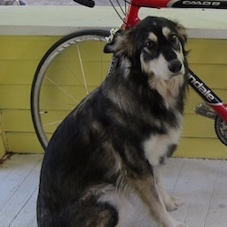

# darknet53

This program loads pretrained weights for the Darknet-53 neural net and uses it to classify images. To run it, you'll need to download the pretrained weights file ([darknet53.weights](https://pjreddie.com/media/files/darknet53.weights)) to this directory. Once you do that, just `cargo run --release`. The example program will use those weights to classify dog.jpg:



The reference implementation ([github.com/pjreddie/darknet](https://github.com/pjreddie/darknet/)):

```
15.53%: malamute
 8.33%: Tibetan mastiff
 7.33%: German shepherd
 6.22%: collie
 3.34%: Shetland sheepdog
```

Our implementation:

```
15.53%: malamute
 8.43%: Tibetan mastiff
 7.38%: German shepherd
 6.16%: collie
 3.26%: Shetland sheepdog
```

That's pretty spot on! There are some minor differences in implementation that result in minor differences in the output. Most notably, different JPG decoders produce slightly different results. There are also some minor differences in the neural net, such as the way batch normalization's epsilon is applied (Our implementation does it the Tensorflow way, which is slightly different from Darknet.).
